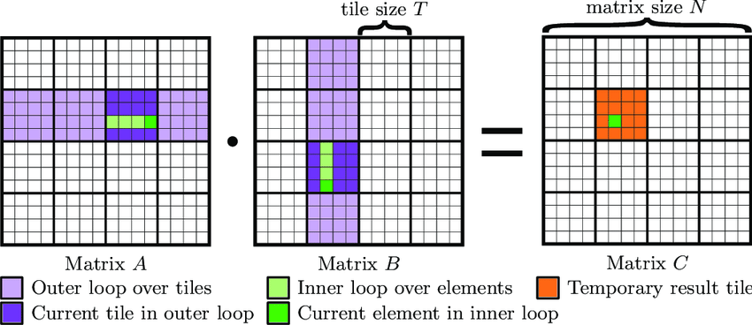

# Implementation of Rader's Algorithm

Rader's algorithm, which is introduced in [Kepner11](#), finds for any graph, represented by its adjacency matrix **A**, its SCC. The algorithm relies on a known relationship in linear algebra, given in equation (1).

\[
(I - A)^{-1} = \sum_{n=0}^{\infty} A^n
\]

Taking this into account, Rader introduces the algorithm given below in equations (2) and (3).

\[
\begin{aligned}
  & C = I + A + \sum_{k=0}^{N} A^k \\
  & D = C \land C^T
\end{aligned}
\]

Where:
- **I**: Identity matrix
- **A**: Input matrix
- **N**: Number of vertices
- **C^T**: Transpose of **C**
- **\land**: Element-wise AND function
- **D**: Matrix with SCC's

There is no explicit mention of the stopping criterion in (2). **k** defines the number of steps. If the steps of the biggest SCC are known, the stopping criteria can be specified. The worst case is \(k = N\). According to [Hong13](#), classifying more than 1% of the vertices is enough to detect the largest SCC. A known optimization is also to detect the largest SCC in a naive way, excise it from the input, and then do the parallel calculations on the smaller search space. In [Matei16](#), possible optimizations before starting parallel calculations are given and explained very well.

We also need to mention that Rader introduces a more compact form of the algorithm (see equation (4)).

\[
D = (I - \alpha A)^{-1}
\]

Where:
- **\alpha**: Sufficiently small scalar

## Notes on the Own Implementation on the GPU

Our own implementation expects an adjacency matrix with a length **N** that should be a multiple of 2. If the adjacency matrix isn't a multiple of 2, we add an extra node to the input matrix (padding). This simple padding makes further implementations on the GPU much easier.

During the matrix multiplications (needed to calculate \(A^2 + A^3 + ... + A^n\) as shown in equation (2)) for large **N**, we observed overflows. Initially, these overflows didn’t cause any problems when comparing the results from the CPU with the GPU. However, under certain circumstances, we observed errors (e.g., fewer than 5 nodes being declared as part of SCCs for \(N \simeq 150\)). Changing the types of the input vectors from *integer* to *unsigned long long int* could solve the issue for very large **N**, but the memory footprint must also be considered. Another problem is the overflow vulnerability on GPUs ([Bang16](#)).

A simple solution to this problem is to set the interim results of the matrix multiplications to 1 if the interim result is non-zero.

The implemented algorithm depends on efficient matrix multiplication. The version using shared memory was therefore implemented with the well-known tiled matrix multiplication. The tiles have a fixed size of \(32 \times 32\) *integers*. The kernel is launched with fixed-size thread-blocks of also \(32 \times 32\) threads, and, depending on the size of the input matrix, with a two-dimensional grid block. The idea of the tiled matrix multiplication is shown in the following figure:


*Figure 1: Schematic view of tiled matrix multiplication. The tiles are sliding over the input matrices, and the matrix multiplication is done on these sub-matrices. Figure taken from [ResearchGate](https://www.researchgate.net/figure/Performance-critical-A-B-part-of-the-GEMM-using-a-tiling-strategy-A-thread-iterates_fig1_318107349).*

## Runtime Analysis for Different Memory Strategies

Rader's algorithm was tested for different memory strategies (shared memory, pinned memory, zero-copy) as well as for naive GPU and CPU implementations. Due to the nature of the algorithm, the main bottleneck is the for-loop (as seen in equation (2)). The algorithm defines the number of steps **k** that must be executed to cover all SCCs. In the worst case, \(k = N\) steps must be calculated, which is often the case. This could be changed if **k** is known, the largest SCC is detected and removed from the input matrix as described in [Hong13](#), or if only small SCCs should be found within a given **k**.

Because of these factors, runtime analysis was not very fruitful. For \(N > 1000\), the runtimes, including the shared memory implementation, were over 1 second. Therefore, no deep runtime analysis was conducted for Rader’s algorithm, and this implementation is not included in the differential testing framework explained in section (##).

## Compiling and Options

The code can be compiled and run as shown below. The program can be executed with two different options. Option **-w** specifies the output path for the result; if it's not defined, no output will be generated. The **-s** option allows the user to define the step-size. If not set, the step-size defaults to **N**.

```bash
# Compilation
$ nvcc rader.cu -o rader

# Executions and options
$ ./rader PATH_TO_INPUTFILE [-w PATH_TO_OUT] [-s STEP-SIZE]
```

In the file **rader.cuh**, the memory strategy to be used can be specified. In the example below, only the kernel with shared memory will be executed.

```c
// Specify which memory strategy should be run
#define CPU 1
#define NAIVE 0
#define PINNED 0
#define ZC 0
#define SHARED 1
```

(Warning messages may appear during compilation if not all memory strategies are set to 1.)

\bibitem[Hon13]{Hong13}
Hong, Sungpack and Rodia, Nicole C. and Olukotun, Kunle.
\textit{On Fast Parallel Detection of Strongly Connected Components (SCC) in Small-World Graphs}. Proceedings of the International Conference on High Performance Computing, Networking, Storage and Analysis, Nov 2013, Denver, USA. Article No:92 Pages 1-11, 10.1145/2503210.2503246

\bibitem[Kep11]{Kepner11}
Kepner, Jeremy and Gilbert, John.
\textit{Graph Algorithms in the Language of Linear Algebra}.
Society for Industrial and Applied Mathematics, 2011, USA. pp. 19-23, 10.5555/2039367.